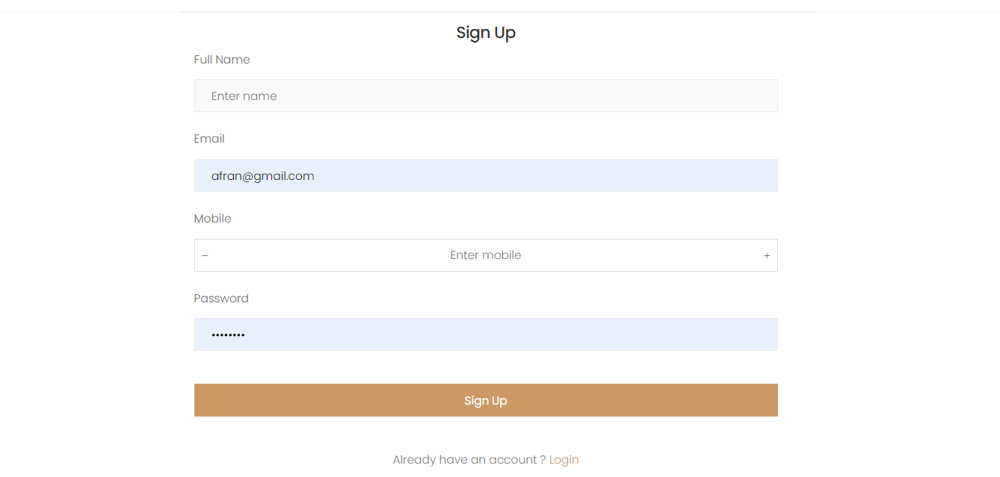
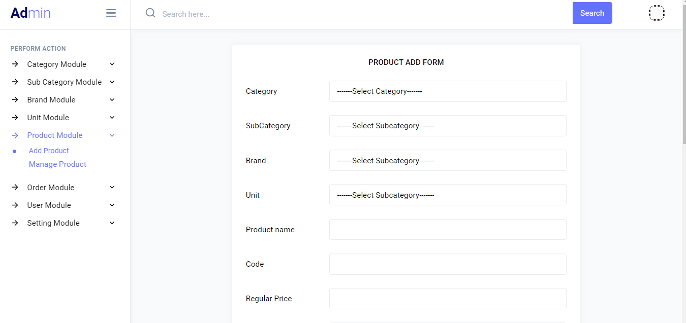
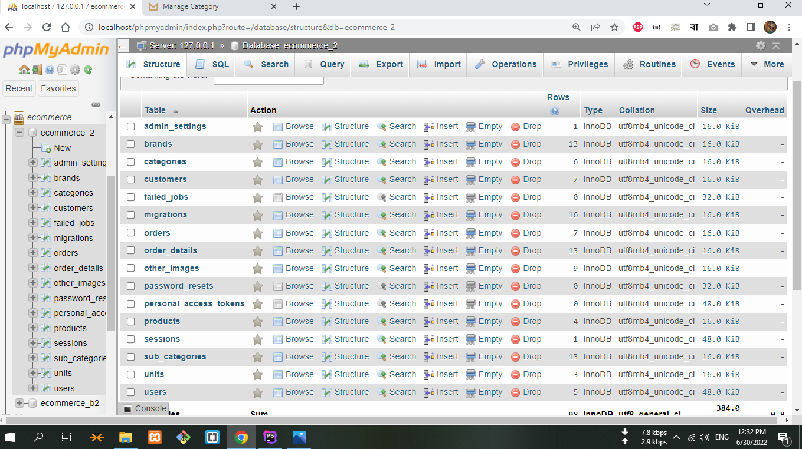

## Completely Dynamic E-Commerce (Project-2) with Laravel -9 (Front + Admin)
#### Project Description: 
This is a dynamic ecommerce website with separate frontend & admin panel,
where admin will be able to manage all the activities like add and manage
category, subcategory, brand, unit, product and also manage to edit orders has been 
coming from users. Featured updated in this  project from last project is
here all admin can't edit and change admin panel. Only Super Admin has 
power to change all activities of admin panel and create and control other users.

#### Technology used: 
    1.HTMl
    2.CSS
    3.BootStrap
    4.JavaScript
    5.jQuery
    6.Laravel
    7.MySQL-DB
    
#### Project Demo : 
 
Please Click over image to see better quality

 
 
 
 
 
 
 
 
 
 
 
 
 
 
 #### Project Demo : 
  
  
  
  
  

 #### Database : 
   
   
 #### Project Author : 
 Name: Mazharul Islam  
 Professional Full Stack Web Developer  
 Email: mazharulislam1998r@gmail.com    
 Cell: +880 1638574281  
 Thanks For Visiting  

